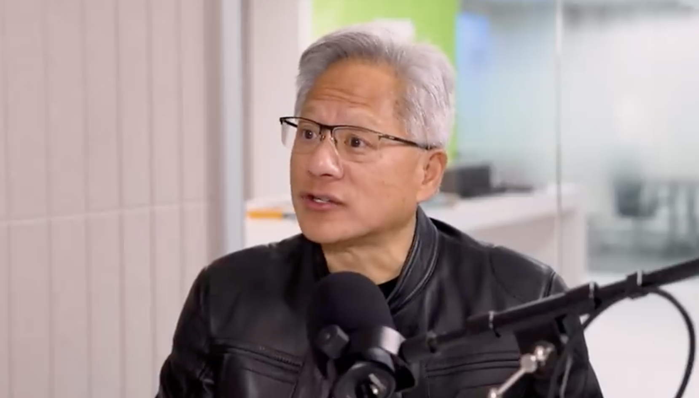

<p align="center" width="100%">

</p>

# <span style="background: linear-gradient(45deg, #667eea 0%, #764ba2 25%, #f093fb 50%, #f5576c 75%, #4facfe 100%); -webkit-background-clip: text; -webkit-text-fill-color: transparent; background-clip: text; font-weight: bold; font-size: 1.1em;">**OmniVinci: Enhancing Architecture and Data for Omni-Modal Understanding LLM [[<u>Link</u>](https://arxiv.org/)]**</span> <br />

[](https://arxiv.org/)
[](https://github.com/NVlabs)
[](https://huggingface.co/nvidia/omnivinci)

<div align="center">

</div>

[Hanrong Ye*†](https://sites.google.com/site/yhrspace/home), Huck Yang†, Arushi Goel†, Wei Huang†, Ligeng Zhu†, Yuanhang Su†, Sean Lin†, An-Chieh Cheng†, Zhen Wan†, Jinchuan Tian†, Yuming Lou†, Dong Yang†, Zhijian Liu, Yukang Chen, Ambrish Dantrey, Ehsan Jahangiri, Sreyan Ghosh, Daguang Xu, Ehsan Hosseini Asl, Danial Mohseni Taheri, Vidya Murali, Sifei Liu, Jason Lu, Oluwatobi Olabiyi, Frank Wang, Rafael Valle, Bryan Catanzaro, Andrew Tao, Song Han, Jan Kautz, Hongxu Yin^†, Pavlo Molchanov^  
<span style="color: rgb(133, 184, 55);">**NVIDIA**</span>  
*Corresponding Author | †Core Authors | ^Senior Authors 

<p align="center" width="100%">

</p>

Advancing machine intelligence requires developing the ability to perceive across multiple modalities, much as humans sense the world.
We introduce OmniVinci, an initiative to build a strong, open-source, omni-modal LLM.
We carefully study the design choices across model architecture and data curation.
For model architecture, we present three key innovations:
**(i)** OmniAlignNet for strengthening alignment between vision and audio embeddings in a shared omni-modal latent space;
**(ii)** Temporal Embedding Grouping for capturing relative temporal alignment between vision and audio signals; and
**(iii)** Constrained Rotary Time Embedding for encoding absolute temporal information in omni-modal embeddings. 
We introduce a curation and synthesis pipeline that generates 24M single-modal and omni-modal conversations. We find that modalities reinforce one another in both perception and reasoning. Our model outperforms Qwen2.5-Omni with +19.05 on DailyOmni (cross-modal understanding), +1.7 on MMAR (audio), and +3.9 on Video-MME (vision), while using just 0.2T training tokens - a 6$\times$ reduction compared to Qwen2.5-Omni’s 1.2T.
We finally demonstrate omni-modal advantages in downstream applications spanning robotics, medical AI, and smart factory. 

| Model        | Omni - Dailyomni | Omni - Worldsense | Audio - MMAU | Audio - MMAR | Vision - MVBench | Vision - Video-MME (w/o sub) |
|--------------|------------------|-------------------|--------------------------|--------------|------------------|------------------------------|
| Qwen2.5-Omni | 47.45            | 45.4              | 71.0                       | 56.7         | 70.3             | 64.3                         |
| Ours         | 66.5             | 48.23             | 71.6                     | 58.4         | 70.6             | 68.2                         |


## News
- [x] [2025.9.30] **OmniVinci-9B** is released! It supports joint understanding of **vision, audio, and text**.

## Model Usage

### Inference
### Envirnoment setup


1. Download and cd huggingface repo
```
huggingface-cli download nvidia/omnivinci --local-dir ./omnivinci --local-dir-use-symlinks False
cd ./omnivinci
```

2. Install python environment (based on NVILA codebase)
```
bash ./environment_setup.sh omnivinci
```

### 🤗 Transformers Usage

#### Video (with audio) Inference Example:
```python
from transformers import AutoProcessor, AutoModel, AutoConfig,AutoModelForCausalLM
import torch
import os

# default: Load the model on the available device(s)
model_path = "./"
video_path = "xxx.mp4"
generation_kwargs = {"max_new_tokens": 1024, "max_length": 99999999}
load_audio_in_video = True
num_video_frames = 128
audio_length = "max_3600"

config = AutoConfig.from_pretrained(model_path, trust_remote_code=True)

model = AutoModel.from_pretrained(model_path,
                                  trust_remote_code=True,
                                  torch_dtype="torch.float16",
                                  device_map="auto")

processor = AutoProcessor.from_pretrained(model_path, trust_remote_code=True)
generation_config = model.default_generation_config
generation_config.update(**generation_kwargs)

model.config.load_audio_in_video = load_audio_in_video
processor.config.load_audio_in_video = load_audio_in_video
if num_video_frames > 0:
    model.config.num_video_frames = num_video_frames
    processor.config.num_video_frames = num_video_frames
if audio_length != -1:
    model.config.audio_chunk_length = audio_length
    processor.config.audio_chunk_length = audio_length


conversation = [{
        "role": "user",
        "content": [
            {"type": "video", "video":video_path},
            {"type": "text", "text": "Assess the video, followed by a detailed description of it's video and audio contents."}
        ]
}]
text = processor.apply_chat_template(conversation, tokenize=False, add_generation_prompt=True)

inputs = processor([text])

output_ids = model.generate(
    input_ids=inputs.input_ids,
    media=getattr(inputs, 'media', None),
    media_config=getattr(inputs, 'media_config', None),
    generation_config=generation_config,
)
print(processor.tokenizer.batch_decode(output_ids, skip_special_tokens=True))
```

- **For a audio and image inference examples please refer to ```example_mini_audio.py``` and ```example_mini_image.py```**

## Examples
<p align="center" width="100%">

</p>

[Video Link](https://1drv.ms/v/c/B25CDB7F0B457DEF/Ecl-nN62pjlDsL3pLMt1nb0BH8rTks_-Yi0w-6kb6PXkDQ?e=VQNn8r)

<span style="color: rgb(133, 184, 55);">**Question**</span>: "What are they talking about in detail?"  
<span style="color: rgb(133, 184, 55);">**Answer**</span>: The video features Jensen Huang with gray hair and glasses, dressed in a black leather jacket, speaking into a microphone in a modern office setting. The background includes a glass wall and a green panel, with a blurred view of desks and chairs. Jensen Huang discusses the evolution of artificial intelligence, focusing on the impact of deep learning and the development of AI frameworks. He emphasizes the importance of data, computing power, and software methodologies in driving AI advancements. The conversation highlights the transformative potential of AI, particularly in perception and generative capabilities, and the need for a new approach to software development. Jensen Huang also mentions the creation of a new AI supercomputer, DGX-1, and its impact on the industry. The video concludes with Jensen Huang discussing the second phase of AI, generative AI, and its potential to revolutionize the way we understand and create information.

<p align="center" width="100%">

</p>

[Video Link](https://1drv.ms/v/c/B25CDB7F0B457DEF/ESjFqXmB_DRNjd76RLym2NYBN-BYhQUOLMtOdNwlXrA5qg?e=CiBq08)

<span style="color: rgb(133, 184, 55);">**Question**</span>: "Describe the video in detail."  
<span style="color: rgb(133, 184, 55);">**Answer**</span>: The video begins with Jensen Huang in a modern, well-lit room with large windows and a view of greenery outside. He dressed in a black jacket and white pants, is seated at a table, writing a message on a black card with a gold pen. The message reads, 'To Robot, Enjoy Your New Brain!' followed by a signature. He then places the card on the table rand begins to open a large black gift box with a gold ribbon and bow. The scene transitions to a close-up of the gift box on the table, with the person's hand visible. The focus then shifts to a robot wearing a white hard hat with the 'NVIDIA' logo, standing in a workshop or industrial setting. The robot holds the same black gift box with the gold ribbon and bow, and it opens the box to reveal the black card with the message. The robot examines the card closely. The narrative continues with the robot, still in the workshop setting, holding the black gift box. The robot opens the box, revealing a sleek, white device with a black screen, nestled in crumpled black paper. The robot examines the device closely, then places it back into the box and closes it. The scene transitions to a different setting, where the robot is now in a modern office environment with green walls and multiple computer monitors. The robot stands behind the closed gift box, gesturing with its hands as if explaining or presenting something. The video wraps up with the robot in the modern office environment, gesturing with its hands. The scene transitions to a close-up of the robot's face, showing its detailed features and expressive eyes. 


## Citation
Please consider to cite our paper and this framework, if they are helpful in your research.

```bibtex
```bibtex
@inproceedings{omnivinci2025,
      title={OmniVinci},
      author={xxx},
      booktitle={xxx},
      year={2025},
}
```